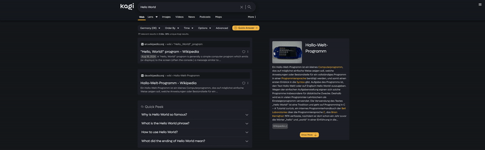
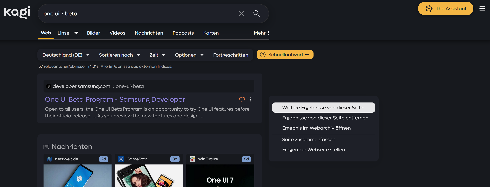
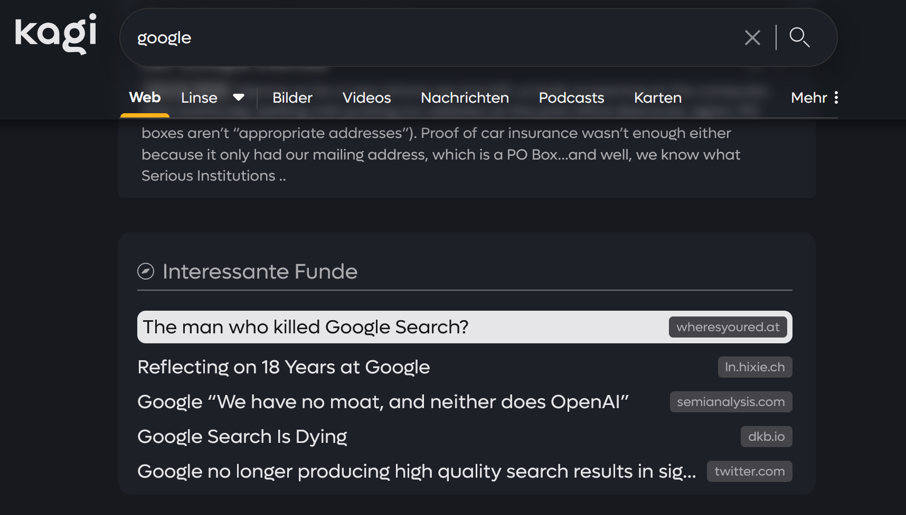
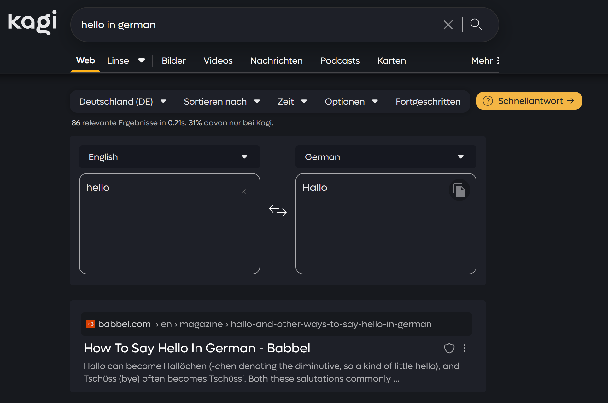
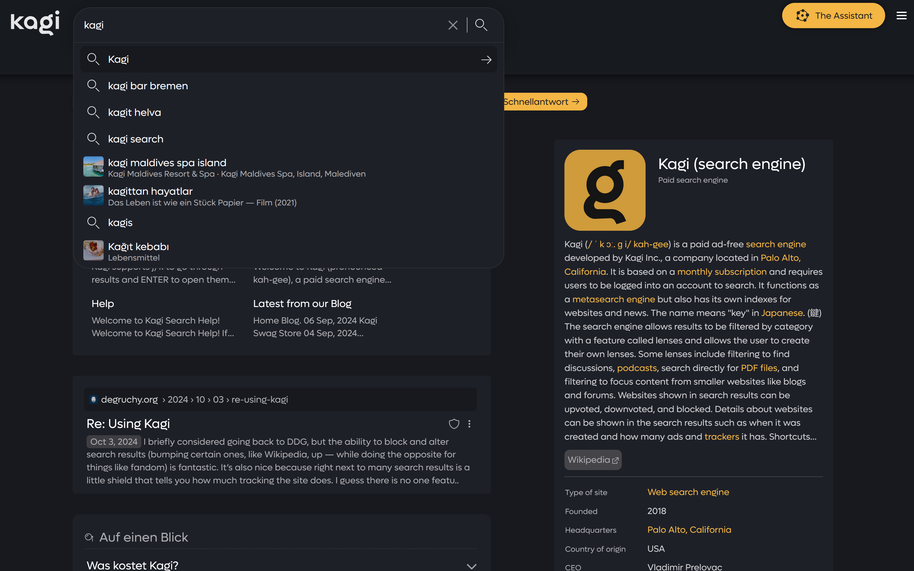

```text
   _____ _                                          _     _               
  / ____| |                                        | |   (_)              
 | |  __| | __ _ ___ ___ _ __ ___   ___  _ __ _ __ | |__  _ ___ _ __ ___  
 | | |_ | |/ _` / __/ __| '_ ` _ \ / _ \| '__| '_ \| '_ \| / __| '_ ` _ \ 
 | |__| | | (_| \__ \__ \ | | | | | (_) | |  | |_) | | | | \__ \ | | | | |
  \_____|_|\__,_|___/___/_| |_| |_|\___/|_|  | .__/|_| |_|_|___/_| |_| |_|
                                             | |                          
                                             |_|                          
                                                                                                                                                                                                  
Kagi Search — Custom Glassmorphism CSS
```
A polished, animated glassmorphism theme for the Kagi search engine. Clean UI, subtle motion, consistent styling across results, images, videos, news, and podcasts.

## Highlights (GIFs)

- Search results


- Top navigation


- Summarizer


- Shield popup


## Gallery (Static Images)

- Start page


- Search results


- Comments UI


- Domain info


- Dropdowns


- Hover highlights (Interesting Finds)


- Translator widget


- URL highlight


- OUTDATED Assistant (sidebar)


- OUTDATED Assistant (panel)


## Overview

kagi-css is a custom stylesheet that gives Kagi a refined glassmorphism look with smooth transitions and a cohesive UI. The CSS is well-commented so you can quickly tweak colors, effects, and spacing to your taste.

## Features

- Glassmorphism visuals for navigation, settings, and key UI elements
- Thoughtful documentation and structure for easy customization
- Smooth animations and hover effects
- Enhanced buttons, search bar, and results layout
- Responsive across desktop and mobile
- Easy color customization via variables at the top of the file
- Uniform styling for results, images, videos, news, and podcasts

## Installation

1) Download custom.css from this repository.
2) In Kagi, enable custom CSS: https://kagi.com/settings?p=custom_css
3) Paste the entire CSS into the input field.
4) Save and refresh Kagi.

Recommended setting: Set URL placement to “Above Title” under Appearance for best visual alignment.


## Animations

- Results fade-in as they load
- Pleasant hover transitions on links and buttons
- Subtle tile and component motion for a lively feel

## What’s New

Good news: The character limit for CSS in Kagi has been increased to 40,000, so the old workaround with add-ons is no longer necessary and the all-in-one solution can be used directly. Thank you, Kagi team! 

The latest update improves the Quick Answer visuals for better emphasis and readability.


## Roadmap

### Near-term
- [x] Consolidate add-ins into a modular, optional build (per-tab bundles)
- [ ] Accessibility contrast pass (WCAG AA) and focus-visible tweaks
- [ ] Optional compact density mode (tighter paddings and gaps)
- [x] Variable cleanup: unified spacing/radius/opacity scales
- [ ] Always update to the latest changes of Kagi
- [ ] Fix z-index bugs

### Mid-term
- [ ] Theme variants: Light (have to update it), Dark+ (already there, see https://github.com/realrogue/kagi-darker), automatic light/dark mode switch
- [ ] Per-tab refinements (Images, Video, News, Podcasts)
- [ ] Reduced motion mode (prefers-reduced-motion support)
- [ ] Improved mobile layout and touch targets

## Tips & Notes

- Mobile: The theme is responsive, but visual density differs from desktop; adjust variables if desired.
- Not affiliated with Kagi. This is a community theme.

## Known Bugs

- List of sources in Assistant not adapted to kagi-css design
- z-indexes are below the Wikipedia article in the first search results

## Contributing

Issues and ideas are welcome. If you spot a bug or have suggestions, reach out on Discord in kagi-discussions → “UI Design Ideas for my custom css”.

Discord thread: https://discord.com/channels/1256077108111868035/1265596713083732060

## Credits

Created by pdanzma. Inspired by modern search UIs (e.g., Google and Brave) with many original touches.

## License

See LICENSE file for terms. Feel free to fork this project and change it to your needs :)
