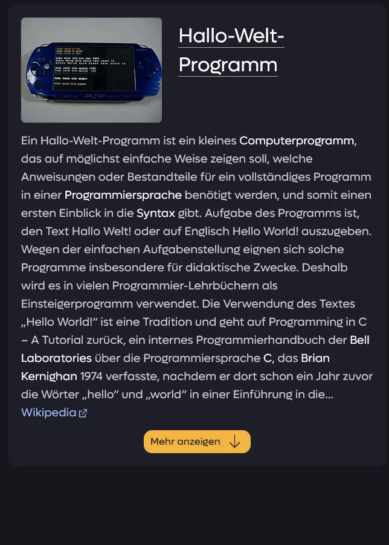
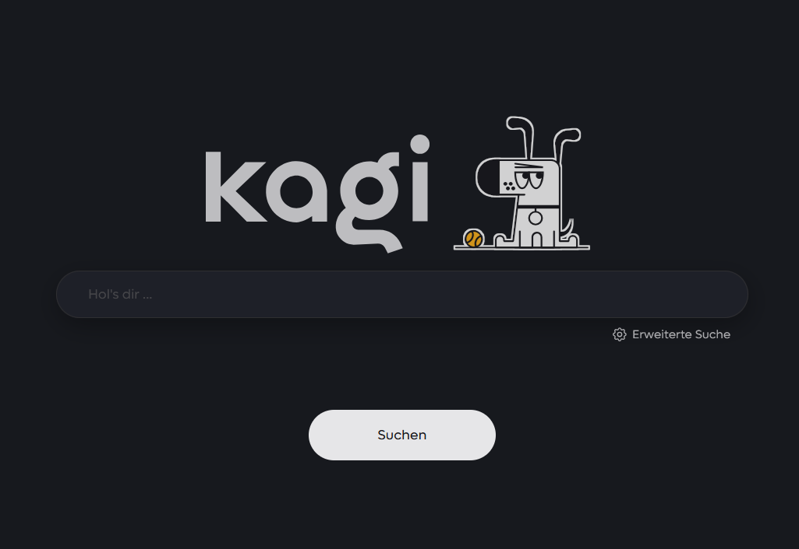

# Custom CSS File for Kagi Search Engine


> **Achtung!** 🆕
> 
> This is the first release and there are many new features! Including glass morphism, transition for almost all buttons, uniform colors and animations and much more.

Enhance your Kagi search experience with custom CSS animations and styles! It's a general overhaul of the search engine user interface and user experience.


---

---

---

---


## Overview

kagi-css is a custom CSS file to beautify and liven up the Kagi search engine interface. With this stylesheet, you can enjoy a more visually appealing and dynamic search experience while using Kagi. Mainly inspired by Google and Brave Search, but with many exciting innovations of its own!

## Features

- **Glassmorphism**: A glass-inspired design for the settings and navigation bar
- **Documentation**: This css file has been documented quite accurately, which is why it is relatively easy to make changes
- **Custom Animations**: Smooth transitions and eye-catching effects
- **Enhanced UI Elements**: Improved buttons, search bar, and results layout
- **Responsive Design**: Looks great on both desktop and mobile devices
- **Easy color changes**: There is a field at the beginning where you can easily change the most important colors as you wish
```
:root {
  --button-color: #F4B644;  /* Primärfarbe für die Buttons */
  --button-hover-color: #E6AB40; /* Sekundärfarbe für die Buttons - beim Hovern - sollte leicht dunkler als die Button Farbe sein */
  --source-highlight-color: #D9A23C; /* Farbe der Quellen und der kleinen Annotationen bei den Verweisen in der Schnellantwort */
  --sri-hover-color: #F4B644; /* Farbe für das Hovern bei Suchergebnissen */
}
```

## Installation

1. Download the `custom.css` file from this repository.
2. Enable custom CSS in Kagi Settings.
3. Paste the code into the inputfield at: [Link](https://kagi.com/settings?p=custom_css)
4. Save and enjoy your enhanced Kagi experience!

## Animations

kagi-css includes several animations to make your search experience more dynamic:

1. **Results Fade-In**: Search results smoothly fade in as they load.
2. **Hover Effects**: Buttons and links have pleasant hover transitions.
3. **Search Tiles**: Also have beautiful animations.

## Any ideas / comments?

If you have an idea that would extend / complete the look of Kagi or if you have found a bug, please write to me on Discord or write in Discord: kagi-discussions -> “UI Design Ideas for my custom css”.

## Note

Since someone in the Discord server missed the little doggo on the start page, it has now been made visible again with this update. However, the code is only commented out, so it can be hidden again at any time.
```
/* Entfernt Doggo-Icon
.doggo_sit_a {
  display: none;
}
*/
```



Another feature is the new WolframAlpha widget, but it is still buggy, so I can't take a picture of it, except the preview of the searchbar.


---
# Enjoy your enhanced Kagi search experience!