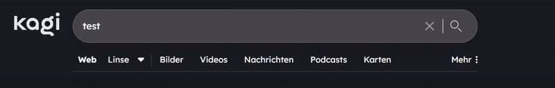
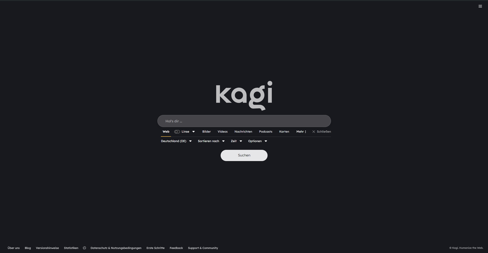

# Custom CSS File for Kagi Search Engine

Enhance your Kagi search experience with custom CSS animations and styles!

## Overview

kagi-css is a custom CSS file designed to beautify and animate the Kagi search engine interface. With this stylesheet, you can enjoy a more visually appealing and dynamic search experience while using Kagi. Mainly inspired from Google and Brave Search.

## Features

- **Custom Animations**: Smooth transitions and eye-catching effects
- **Enhanced UI Elements**: Improved buttons, search bar, and results layout
- **Responsive Design**: Looks great on both desktop and mobile devices

## Installation

1. Download the `custom.css` file from this repository.
2. Enable custom CSS in Kagi Settings.
3. Paste the code into the inputfield at: [Link](https://kagi.com/settings?p=custom_css)
4. Save and enjoy your enhanced Kagi experience!

## Animations

kagi-css includes several animations to make your search experience more dynamic:

1. **Results Fade-In**: Search results smoothly fade in as they load.
2. **Hover Effects**: Buttons and links have pleasant hover transitions.
3. **Search Tiles**: Also have beautiful animations.

## Preview

Enjoy your enhanced Kagi search experience!
