```text
   _____ _                                          _     _               
  / ____| |                                        | |   (_)              
 | |  __| | __ _ ___ ___ _ __ ___   ___  _ __ _ __ | |__  _ ___ _ __ ___  
 | | |_ | |/ _` / __/ __| '_ ` _ \ / _ \| '__| '_ \| '_ \| / __| '_ ` _ \ 
 | |__| | | (_| \__ \__ \ | | | | | (_) | |  | |_) | | | | \__ \ | | | | |
  \_____|_|\__,_|___/___/_| |_| |_|\___/|_|  | .__/|_| |_|_|___/_| |_| |_|
                                             | |                          
                                             |_|                          
                                                                                                                                                                                                  
Kagi Search — Custom Glassmorphism CSS
```
A polished, animated glassmorphism theme for the Kagi search engine. Clean UI, subtle motion, consistent styling across results, images, videos, news, and podcasts.

## Gallery (Static Images)

- Start page
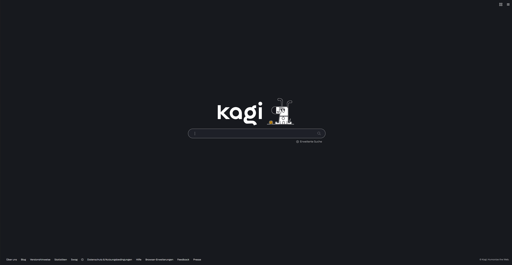

- Search results
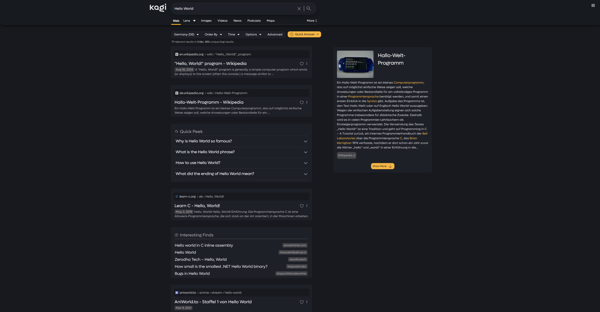

- Searchbar
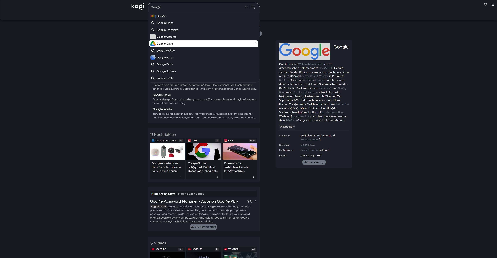

- Quick Answer
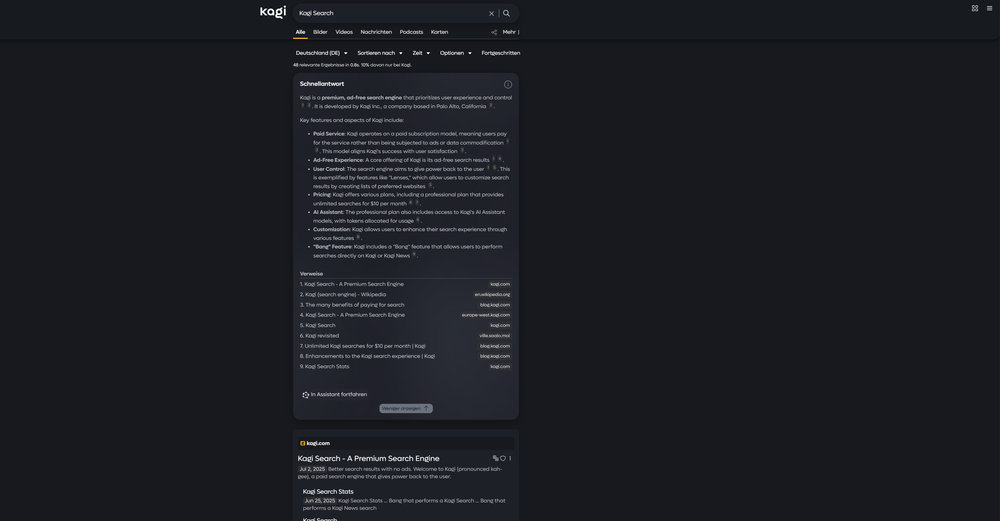

- Domain info
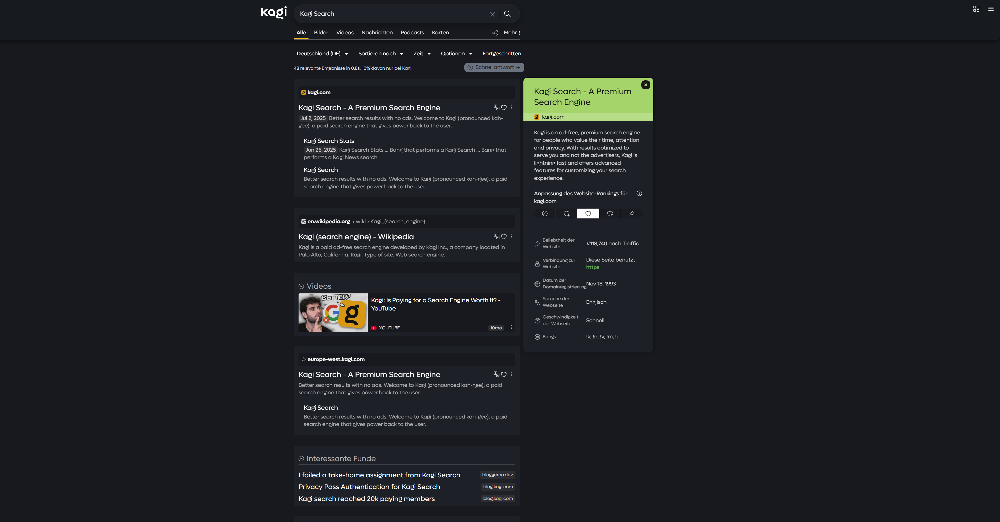

- Dropdowns
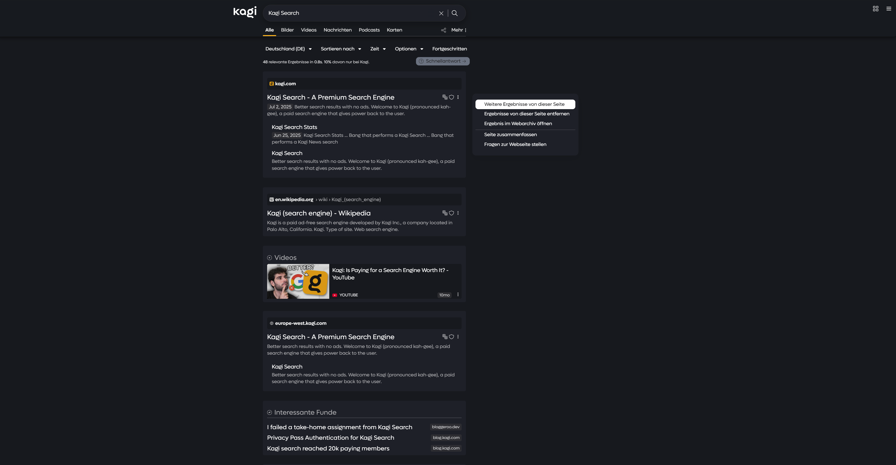

- Glassy Dropdown
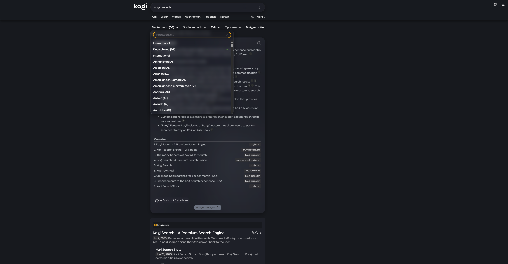

- Assistant
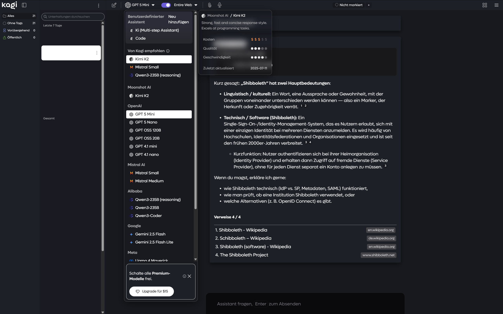

- Assistant Prompt Box
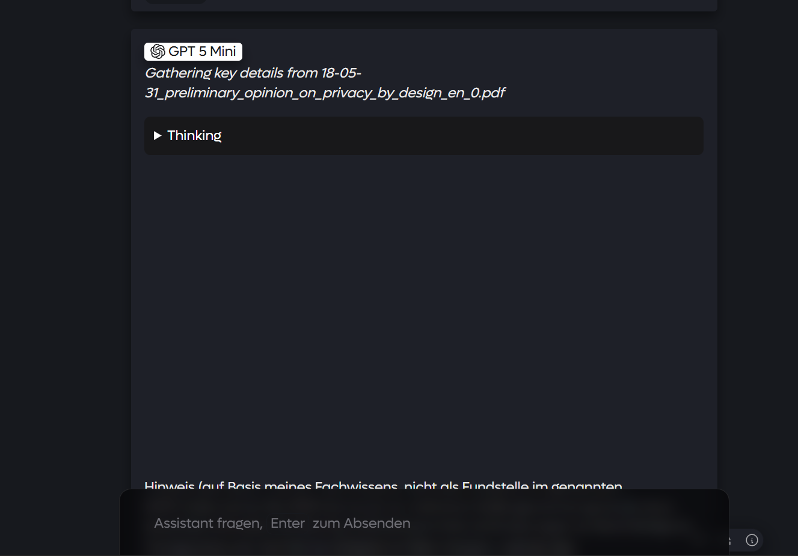

- News Tab
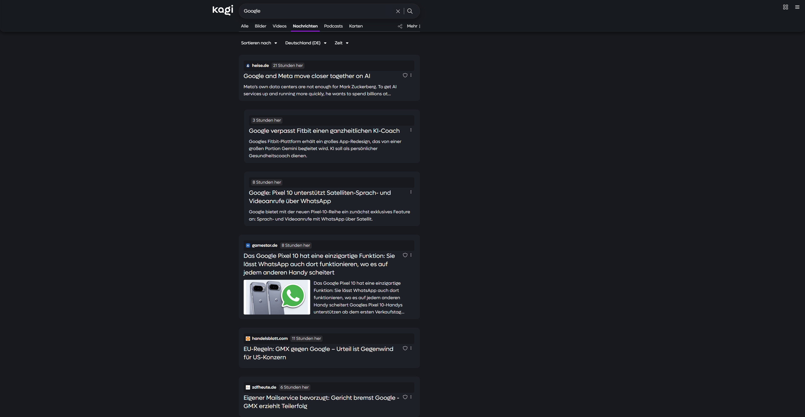

- Podcasts Tab
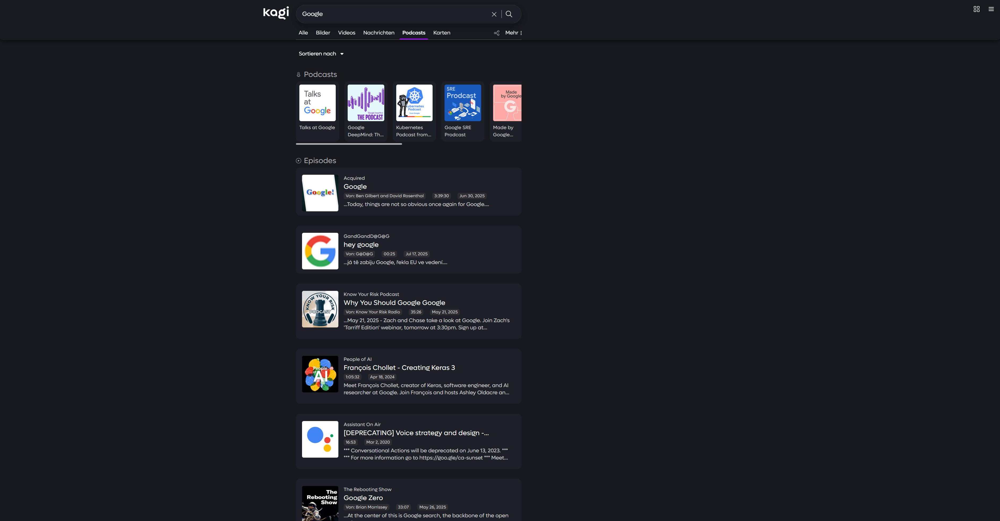

- Mobile Assistant Chat
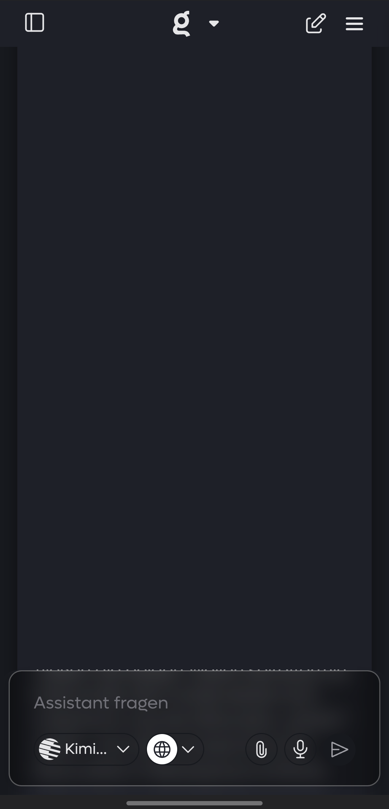

- Mobile Assistant Dropdown
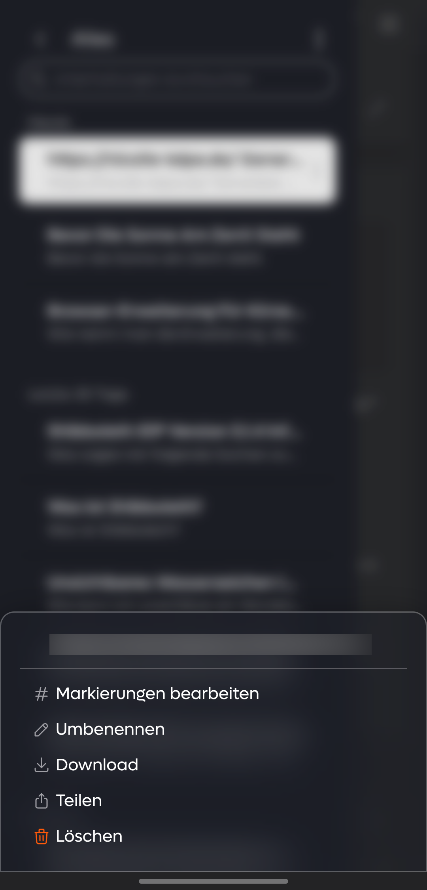

- Mobile Assistant Sidebar
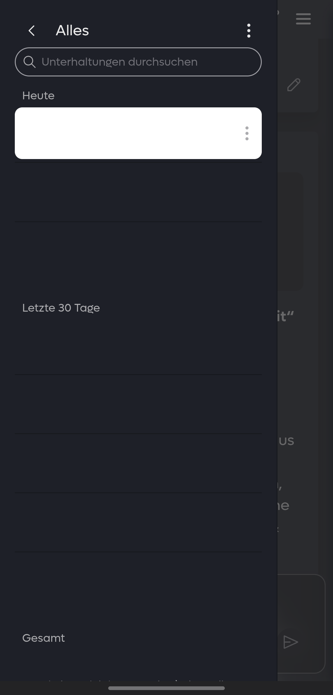

- Mobile Assistant Interface
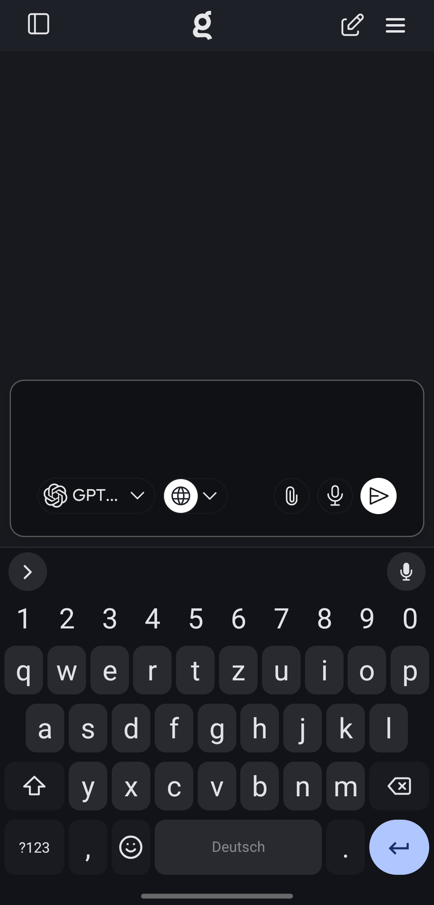

## Overview

kagi-css is a custom stylesheet that gives Kagi a refined glassmorphism look with smooth transitions and a cohesive UI.

## Features

- Glassmorphism visuals for navigation, settings, and key UI elements
- Thoughtful documentation and structure for easy customization
- Smooth animations and hover effects
- Enhanced buttons, search bar, and results layout
- Responsive across desktop and mobile
- Easy color customization via variables at the top of the file
- Uniform styling for results, images, videos, news, and podcasts

## Installation

1) Download custom.css from this repository.
2) In Kagi, enable custom CSS: https://kagi.com/settings?p=custom_css
3) Paste the entire CSS into the input field.
4) Save and refresh Kagi.

Recommended setting: Set URL placement to “Above Title” under Appearance for best visual alignment.

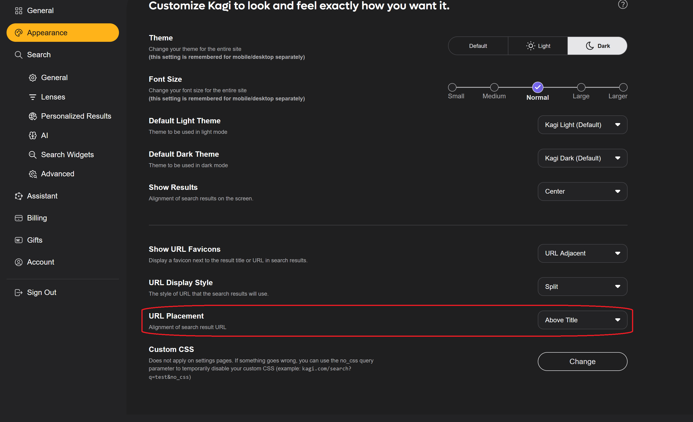

If you encounter problems with glass morphing in Firefox, this is not a problem and does not prevent you from using this theme. Simply comment out the following code.

```css
/* If Firefox has problems with the blur effect, comment out this code. <--- delete this line
@-moz-document url-prefix() {
  .backdrop-blur-elements {
    backdrop-filter: none !important;
    -webkit-backdrop-filter: none !important;
    background: rgba(30, 32, 40, 0.95) !important;
  }
} delete this ---> */ 
```

## Animations

- Results fade-in as they load
- Pleasant hover transitions on links and buttons
- Subtle tile and component motion for a lively feel

## What’s New

Good news: The character limit for CSS in Kagi has been increased to 40,000, so the old workaround with add-ons is no longer necessary and the all-in-one solution can be used directly. Thank you, Kagi team! 

### 05. September 2025

**Major Update**
The Quick Answer got a new background (not clearly visible because of compression)


- Percentage display now matches the source reference.
- Fixed a bug that prevented Quick Settings from being clicked.
- The source pop-up now matches the style of the search results.
- The style in the Assistant now matches the Quick Answers.
- The hover effect for "A look into the past" now matches the global styling.
- Hover boxes in Quick Answers are now displayed correctly (though it's not a perfect solution - noticeable when scrolling).
- The style has now also been applied to the video and podcast sections.
- The lens dropdown menu now adapts to the styling.
- Now supports lenses in the search bar.


If you still experience severe performance drops due to the various glass morphing effects, you can also search for the rules in the CSS and explicitly set them to none. Here's how:
```css
/* Search for the term: */
    backdrop-filter: blur(12px) saturate(120%);
    -webkit-backdrop-filter: blur(12px) saturate(120%);

/* change it to: */
   backdrop-filter: none;
   -webkit-backdrop-filter: none;

/* or completly delete the following lines */
   backdrop-filter: blur(12px) saturate(120%);
   -webkit-backdrop-filter: blur(12px) saturate(120%);
   background: rgba(30, 32, 40, 0.12);
                  ^-- to: rgb   ^----- delete the forth argument
   
/* should look like this after: */
   background: rgb(30, 32, 40);
```

A big thank you to @Temanor on Discord, who sent me lots of bugs with pictures.

## Roadmap

### Near-term
- [x] Accessibility contrast pass (WCAG AA) and focus-visible tweaks
- [ ] Optional compact density mode (tighter paddings and gaps)
- [~] Always update to the latest changes of Kagi
- [ ] Fix z-index bugs

### Mid-term
- [ ] Theme variants: Light (have to update it), Dark+ (already there, see https://github.com/realrogue/kagi-darker), automatic light/dark mode switch
- [x] Per-tab refinements (Images, Video, News, Podcasts)
- [x] Reduced motion mode (prefers-reduced-motion support)
- [ ] Improved mobile layout and touch targets

## Tips & Notes

- Mobile: The theme is responsive, but visual density differs from desktop; adjust variables if desired.
- Not affiliated with Kagi. This is a community theme.

## Known Bugs

- z-indexes are below the Wikipedia article in the first search results

## Contributing

Issues and ideas are welcome. If you spot a bug or have suggestions, reach out on Discord in kagi-discussions → “UI Design Ideas for my custom css”.

Discord thread: https://discord.com/channels/1256077108111868035/1265596713083732060

## Credits

Created by pdanzma. Inspired by modern search UIs (e.g., Google and Brave) with many original touches.

## License

See LICENSE file for terms. Feel free to fork this project and change it to your needs :)
